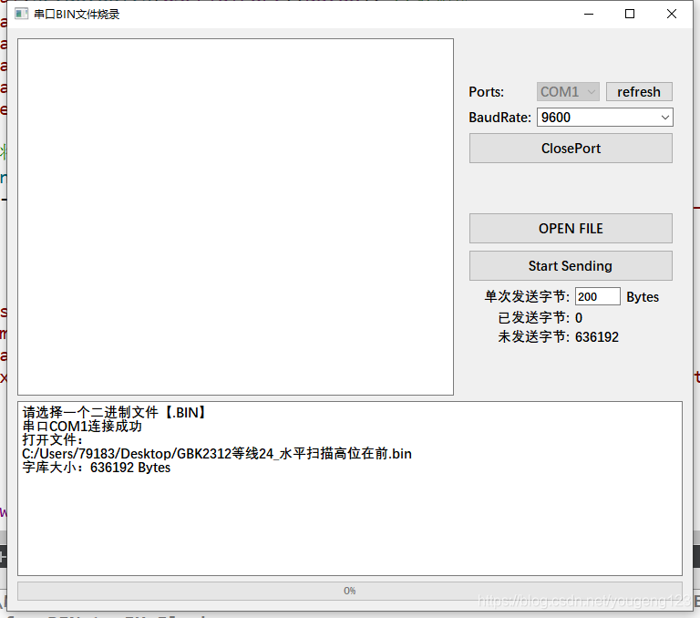
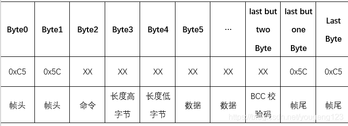
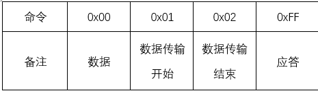
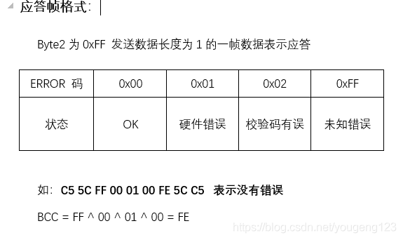

# STM32串口烧录BIN文件、字库文件【QT上位机】

**项目已开源至GitHub，供大家一起学习使用 [*点我传送*](https://github.com/firestaradmin/Uart_Transfer_BIN_to_exFlash)**


## 一.上位机部分

- 使用QT-C++ 编写的上位机	预览图如下

- 程序思路：
 	使用串口通讯进行发送规定的帧数据，上位机会将BIN文件数据分析打包成每一帧传送给下位机。
下位机，接受到数据后，进行ACK应答，程序接受到应答后，继续发送数据，直至完成发送。
### 1.帧协议格式：



如发送数据：**C5 5C 00 00 04 22 33 44 FF AE 5C C5**
BCC = 除了帧头帧尾和bcc本身的异或
BCC = 00 ^ 00 ^ 04 ^ 22 ^ 33 ^ 44 ^ FF = AE

### 2.QT部分程序

```cpp
//将串口的 readyread 信号绑定到 read_com 这个槽函数上
connect(&mySerial,SIGNAL(readyRead()),this,SLOT(read_COM()));
```
此处读取到下位机的ACK应答后，触发自定义信号[readOK]，再进行下一步发送
```cpp
void MainWindow::read_COM()
{
    QByteArray mytemp = mySerial.readAll();

    if(!mytemp.isEmpty())
    {
        //qDebug() << mytemp.toHex();
        if((mytemp.at(0) & 0xff) != 0xC5)
            return;
        if((mytemp.at(1) & 0xff) != 0x5C)
            return;
        if((mytemp.at(5) & 0xff) == 0x00){

            ui->textEdit_Log->append("send Data OK!");
            sendedBytes += currentLen;
            unSendedBytes = file_length - sendedBytes;
            if(unSendedBytes < 0)
                unSendedBytes = 0;
            ui->label_sendedBytes->setNum(sendedBytes);
            ui->label_unSendedBytes->setNum(unSendedBytes);
            ui->progressBar->setValue(static_cast<int>((static_cast<float>(sendedBytes) / static_cast<float>(file_length)) * 100));
            if(unSendedBytes > 0){
                emit(recvOK());
            }else {
                ui->textEdit_Log->append("all data send over!");
                ui->pushButton_StartSending->setEnabled(true);
            }

        }
        else {
            ui->pushButton_StartSending->setEnabled(true);
            ui->textEdit_Log->append("send Data failed!");
            ui->textEdit_Log->append(QString("ERROR:%1").arg(mytemp.at(5) & 0xff));
        }
        //mytemp.clear();
    }
}
```


```cpp
//将自定义的信号和发送函数连接
connect(this, &MainWindow::recvOK, this, &MainWindow::sendOnce);
```

```cpp

void MainWindow::sendOnce(){
    QByteArray sendBuf, dataBuf;

    char file_length0,file_length1;
    QString str;
    char bcc = 0x00;

    if(unSendedBytes >= ui->lineEdit_ByteNum->text().toInt()){
        dataBuf = file_array.mid(sendedBytes, ui->lineEdit_ByteNum->text().toInt());
        currentLen = ui->lineEdit_ByteNum->text().toInt();
     }
    else {
        dataBuf = file_array.mid(sendedBytes, unSendedBytes);
        currentLen = unSendedBytes;
    }
    //qDebug() << dataBuf.size();
    sendBuf.clear();
    sendBuf.append("\xC5\x5C");
    sendBuf.append(static_cast<char>(0));
    file_length0 = static_cast<char>(currentLen / 0xFF);
    file_length1 = static_cast<char>(currentLen % 0xFF);
    sendBuf.append(file_length0);
    sendBuf.append(file_length1);
    //qDebug() << sendBuf.toHex().toUpper();

    sendBuf.append(dataBuf);
    //qDebug() << sendBuf.toHex().toUpper();

    for(int i = 2; i < sendBuf.size(); i++){
        //str.append((QString("%1  ").arg(file_array.at(i) & 0xff, 2, 16, QLatin1Char('0')).toUpper()));
        bcc ^= sendBuf.at(i) & 0xff;
    }
    sendBuf.append(bcc);
    sendBuf.append("\x5C\xC5");
    //qDebug() << sendBuf.toHex().toUpper();

    for(int i = 5; i < sendBuf.size() - 3; i++){
        str.append((QString("%1  ").arg(sendBuf.at(i) & 0xff, 2, 16, QLatin1Char('0')).toUpper()));
    }
    ui->textEdit_Status->append("---------------------------------------");
    ui->textEdit_Status->append(QString("地址[ %1 ] to [ %2 ] 的数据：").arg(sendedBytes).arg(sendedBytes + currentLen - 1));
    ui->textEdit_Status->append(str);
    ui->textEdit_Status->append(QString("---  BCC校验码: %1  ---").arg(bcc & 0xff, 2, 16, QLatin1Char('0')).toUpper());

    ui->textEdit_Log->append(QString("send [ %1 ] to [ %2 ] Data ...").arg(sendedBytes).arg(sendedBytes + currentLen - 1));
    mySerial.write(sendBuf);


}
```

## 二.下位机部分
### 1.接收与处理
上位机将BIN文件分成若干可设置数据长度的帧数据，以帧的形式串口发送给下位机，下位机接收帧，检验帧头帧尾和BCC校验码，如果正确无误，将数据烧写至外部储存器，烧写完成后，发送应答给上位机。上位机发送一帧数据后，会等待下位机的应答，接收到应答后，再继续发送下一帧数据，直至全部发送完成。
### 2.ACK应答帧格式

### 3.下位机通用C++代码（Lib）

```cpp
//"transfer_BIN_to_EX_FLASH.h"
#ifndef __transfer_BIN_to_EX_FLASH
#define __transfer_BIN_to_EX_FLASH

extern u8 TBEF_uart_recv_finish , TBEF_uart_recving_flag , rTBEF_uart_recv_tim_cnt;
//extern u8 TBEF_recvBuf[400];
//extern u16 TBEF_recvBuf_tail;


void TBEF_uart_receive_process(u8 data);

void TBEF_tim_process(void);
void TBEF_SendACK(u8 ERROR);
void TBEF_clearRecvBuf();
u8 TBEF_framePrasing();
void TBEF_mainFun();
void TBEF_data_CallBack(u8 *dataBuf, u16 len);
#endif


```

```cpp
/************************************************************************************
*  Copyright (c), 2020, LXG.
*
* FileName		:
* Author		:firestaradmin
* Version		:1.0
* Date			:2020.7.21
* Description	:串口接收BIN文件数据烧录至外部储存器
* History		:
*
*
*************************************************************************************
帧协议格式:
		Byte0	Byte1	Byte2		Byte3		Byte4		Byte5	…		last but two Byte	last but one Byte	Last Byte
		0xC5	0x5C	XX			XX			XX			XX		XX		XX					0x5C				0xC5
		帧头	帧头	命令		长度高字节	长度低字节	数据	数据	BCC校验码			帧尾				帧尾
		
		如发送数据：C5 5C 00 00 04 22 33 44 FF AE 5C C5
		BCC = 除了帧头帧尾和bcc本身的异或
		BCC = 00 ^ 00 ^ 04 ^ 22 ^ 33 ^ 44 ^ FF = AE

命令:	0x00	0x01			0x02			0xFF
备注:	数据	数据传输开始	数据传输结束	应答

*************************************************************************************/


#include "stm32f10x.h"
#include "../bsp/transfer_BIN_to_EX_FLASH/transfer_BIN_to_EX_FLASH.h"
#include "../bsp/w25qxx/w25qxx.h" 
#include "../BSP/usart/usart.h"

//W25Q64
//容量为8M字节,共有128个Block,2048个Sector 
//4Kbytes为一个Sector
//16个扇区为1个Block

//以下表示地址为W25QXX的第一个区块的第0个扇区的第0个地址
#define W25QXX_STORAGE_Block	1
#define W25QXX_STORAGE_Sector	0
#define W25QXX_STORAGE_Sector_OFFSET	0
u32 TBEF_W25QXX_StorageAddress = W25QXX_STORAGE_Block * 4 * 1024 * 16 + 4 * 1024 * W25QXX_STORAGE_Sector + W25QXX_STORAGE_Sector_OFFSET;	//要烧录的具体地址
u32 bytesStored = 0;	//已经储存的字节

u8 TBEF_recvBuf[1000];	//接受buf，最大单次传输字节数应不大于buf大小-8
u16 TBEF_recvBuf_tail = 0;
u8 TBEF_uart_recv_finish = 0, TBEF_uart_recving_flag = 0, TBEF_uart_recv_tim_cnt = 0;


//用户回调函数，此处修改需要烧录的函数
void TBEF_data_CallBack(u8 *dataBuf, u16 len)
{
	//根据需求修改此处
	W25QXX_Write(dataBuf, TBEF_W25QXX_StorageAddress + bytesStored, len);//写入flash
	
	bytesStored += len;
}

//串口处理函数，在串口中断中调用，将接收到的字节传入data
void TBEF_uart_receive_process(u8 data)
{  	
	if(TBEF_uart_recv_finish == 0){
		TBEF_recvBuf[TBEF_recvBuf_tail++] = data;		// 存入缓存数组
		TBEF_uart_recving_flag = 1;                     // 串口 接收标志
		TBEF_uart_recv_tim_cnt = 0;	                    // 串口接收定时器计数清零	
	}
	if(TBEF_recvBuf_tail >= sizeof(TBEF_recvBuf))
	{
		 TBEF_recvBuf_tail = 0;                               	// 防止数据量过大
	}		
	
}

//定时器处理函数，在定时器中断中调用，1Ms一次
void TBEF_tim_process(void)		//1MS调用一次
{
	/* 串口接收完成判断处理 */
	if(TBEF_uart_recving_flag)                        	// 如果 usart接收数据标志为1
	{
		TBEF_uart_recv_tim_cnt++;             // usart 接收计数	
		if(TBEF_uart_recv_tim_cnt > 10)       // 当超过 3 ms 未接收到数据，则认为数据接收完成。
		{
			TBEF_uart_recv_finish = 1;
			TBEF_uart_recving_flag = 0;
			TBEF_uart_recv_tim_cnt = 0;
		}
	}
	
}

//在主函数中调用，需要一直循环调用，此函数为阻塞函数
void TBEF_mainFun()
{
	u8 ret = TBEF_framePrasing();
	TBEF_recvBuf_tail = 0;
	TBEF_uart_recv_finish = 0;
	TBEF_SendACK(ret);
}

u8 TBEF_framePrasing()
{
	u16 length = 0;
	u8 cmd = 0;
	u8 bcc = 0x00;
	while(TBEF_uart_recv_finish != 1);	//wait receive finish
	
	
	if(TBEF_recvBuf[0] != 0xC5)
		return 1;	//帧头错误
	if(TBEF_recvBuf[1] != 0x5C)
		return 1;	//帧头错误
	cmd = TBEF_recvBuf[2];
	length = TBEF_recvBuf[3] * 0xFF + TBEF_recvBuf[4];
	
	for(u16 i = 2; i < 5 + length; i ++){
		bcc ^= TBEF_recvBuf[i];
	}
	
	if(bcc != TBEF_recvBuf[5 + length])
		return 2;	//bcc校验码错误
	
	if(TBEF_recvBuf[6 + length] != 0x5C)
		return 3;	//帧尾错误
	if(TBEF_recvBuf[7 + length] != 0xC5)
		return 3;	//帧尾错误
	
	
	if(cmd == 0x00)
	{
		TBEF_data_CallBack(TBEF_recvBuf + 5, length);
	}
	else if(cmd == 0x01)
	{
		bytesStored = 0;
	}
	else if(cmd == 0x02)
	{
	
	}else {
		
	}
	
	
	return 0;
	
}

//如：C5 5C FF 00 01 00 FE 5C C5	表示没有错误
void TBEF_SendACK(u8 ERROR)
{
	u8 sendBuf[9] = {0xC5, 0x5C, 0xFF, 0x00, 0x01, ERROR, 0x00, 0x5C, 0xC5};
	sendBuf[6] = sendBuf[2] ^ sendBuf[3] ^ sendBuf[4] ^ sendBuf[5] ; 
	
	UartSendMultByte(USART1, sendBuf, 9);
}

void TBEF_clearRecvBuf()
{
	while(TBEF_recvBuf_tail--)
	{
		TBEF_recvBuf[TBEF_recvBuf_tail] = 0;
	}
	
}
```


## 三、使用教程

1. 下位机移植完成后，连接串口至电脑。
2. 点击refresh按钮，刷新串口列表，选择下位机终端的COM口，连接
3. 加载BIN文件
4. 设置单次发送字节数
5. 开始发送，等待发送完成即可